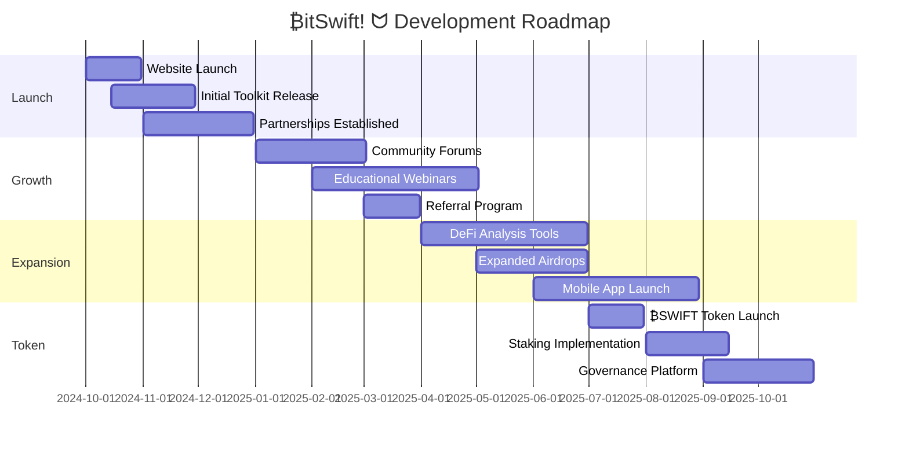

# ₿itSwift! ᗢ - Your Gateway to DeFi & Blockchain 🚀

## 🌟 Quick Links
[🌐 Website](https://swiftcrypto.tools) | [💬 Telegram](https://t.me/BitSwiftDeFi) | [📘 Docs](https://docs.swiftcrypto.tools) | [🛒 Shop](https://shop.swiftcrypto.tools)

## 👑 Leadership

₿itSwift! ᗢ is led by our visionary CEO, known in the crypto world as Commander 🎖️. With a background in advanced blockchain development and a knack for turning complex DeFi concepts into user-friendly tools, Commander 🎖️ is steering our ship towards the decentralized future.

- GitHub: [@not-a-developers](https://github.com/not-a-developers)
- Telegram: [@ProbablyDev](https://t.me/ProbablyDev)

Under the Commander's leadership, ₿itSwift! ᗢ is not just a company; it's a movement in the DeFi space, constantly pushing the boundaries of what's possible in blockchain technology.

## 🤝 Our Partners

We're proud to collaborate with the best in the blockchain industry. Our partnership with [scripters.shop](https://scripters.shop) brings additional firepower to our toolkit offerings, ensuring that our users have access to the most comprehensive and advanced DeFi solutions available.

  

Together, we're creating a synergy that amplifies our impact in the DeFi ecosystem, offering unparalleled tools and services to crypto enthusiasts and professionals alike.

## 📊 Token Metrics

| Metric | Value |
|--------|-------|
| Token Name | ₿SWIFT |
| Total Supply | 100,000,000 |
| Initial Price | $0.10 |
| Listing | PancakeSwap, UniSwap |
| Contract | `0x... (TBA)` |

## 🗺️ Roadmap

[The rest of the README continues as before...]
